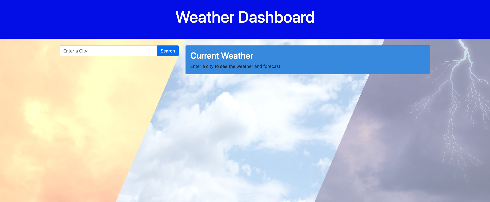
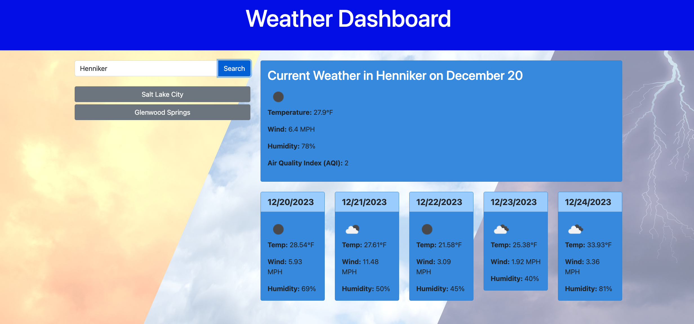

# Weather-Dashboard

## Description 
This application uses a weather API to display the current weather (temperature, wind, humidity, and Air Quality Index) for any given city in the US. It also displays the weather forecast for the next 5 days in that specific city. When you enter a city to search for the weather, the application saves the previously searched cities in a list under the search bar. The previously saved cities can be clicked to display the weather in that particular city again.

## How to Use This Application

1. Enter the name of a city in the search bar
2. Click on the 'Search' button 
3. View current weather conditions in that city and the 5 day forecast for that city
5. Click on any of the last searched city buttons under the search bar to quickly retrieve the weather information for that location again.

## Demonstration 

Below is a screenshot giving an example of the initial page when you load the application.

Here is an example of the data displayed when you search for a city. As you can see, previously searched cities such as "Glenwood Springs" and "Salt Lake City" appear under the search bar and can be easily clicked if you wanted to revisit the weather on that page, and the current city of Henniker, New Hampshire's weather is showing in the current weather box and 5 day forecast cards. 

## Resources

Weather API:
Deployed GitHub Link

